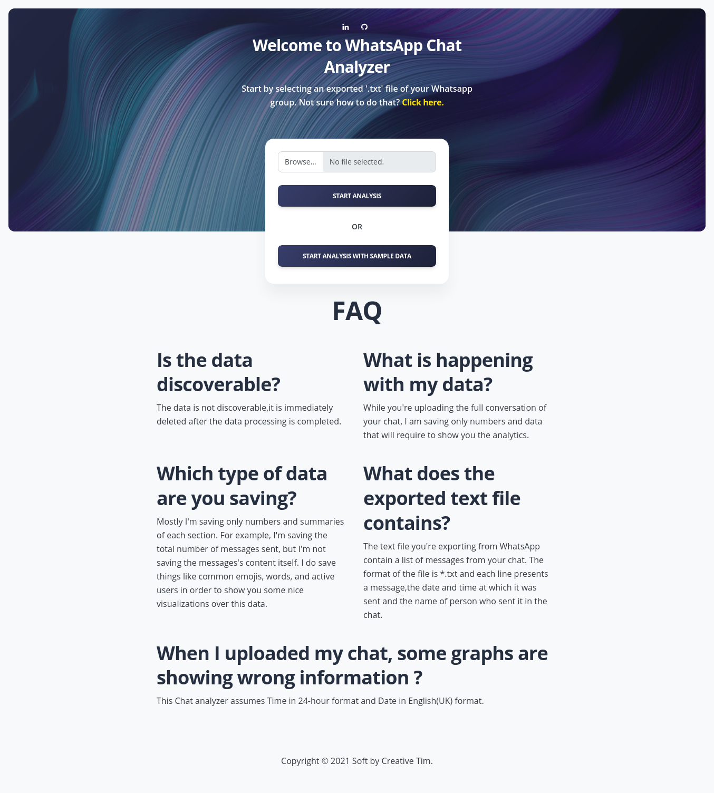
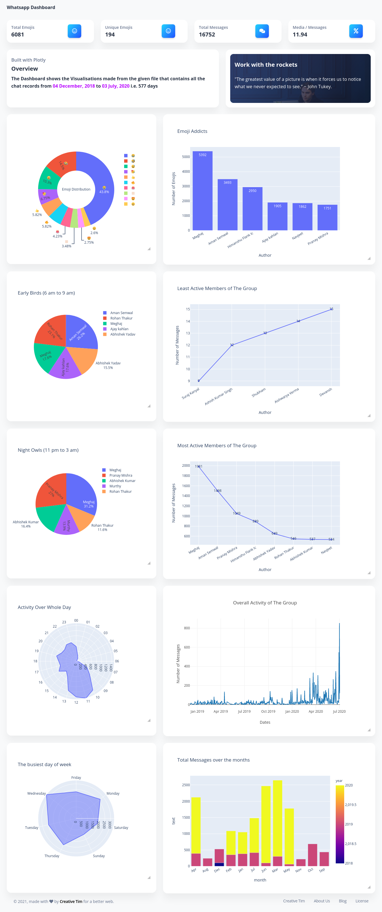

# [WhatsApp-Chat-Analyzer]

> **You can view the working project [here](https://wa-chat-analysis.herokuapp.com/).**







WhatsApp chat Analyzer is a WebApp where anyone either tech or non-tech person can analyze their WhatsApp chat data. With this,
With this, you can get information such as
 -----------------------
- Emoji Distribution
- Emoji Addicts (Top 6)
- Early Birds (6am to 9am)
- Least Active Members of the Group
- Night Owls (11pm to 3am)
- Most Active Members of the Group
- Activity Over Whole Day
- Overall Activity of the Group
- Busiest Day of week
- Total Messages over the month(s)

**Important: Don't worry, none of your data is stored.**

## Getting Started


**1.** Fork this repository.

**2.** Clone the forked repository.

**3.** Navigate to the project directory.

**4.** Create a new branch.

```bash
git checkout -b <your_branch_name>
```

**5.** Make changes in source code.

**6.** Stage your changes and commit

```bash
#Add changes to Index
git add .

#Commit to the local repo
git commit -m "<your_commit_message>"
```

>CAUTION: Synch up your local repo with [original repo](https://github.com/pcsingh/WhatsApp-Chat-Analyzer) (Upstream) before pushing your commits.
>This avoids unnecessary conflicts during the merge.

**7.** Push your local commits to the remote repo.

```bash
git push -u origin <your_branch_name>
```

**8.** Create a [PR](https://help.github.com/en/github/collaborating-with-issues-and-pull-requests/creating-a-pull-request) !


# Tech Stack:
 1. Plotly
 2. Flask
 3. Bootstrap
 4. HTML & CSS
 5. Pandas
 6. Gunicorn
 7. Jinja

 This whole Project is Deployed with help of <u> Heroku </u>


## Running the project

This project was created with [Flask](https://palletsprojects.com/p/flask/).


In the project directory, you can run:
(for python 3 and above)
#### `pip3 install -r requirements.txt`
which installs all the necessary dependencies.

#### `python3 run.py`
Run the app in the development mode.<br>
Open [http://localhost:5000](http://localhost:5000) to view it in the browser.